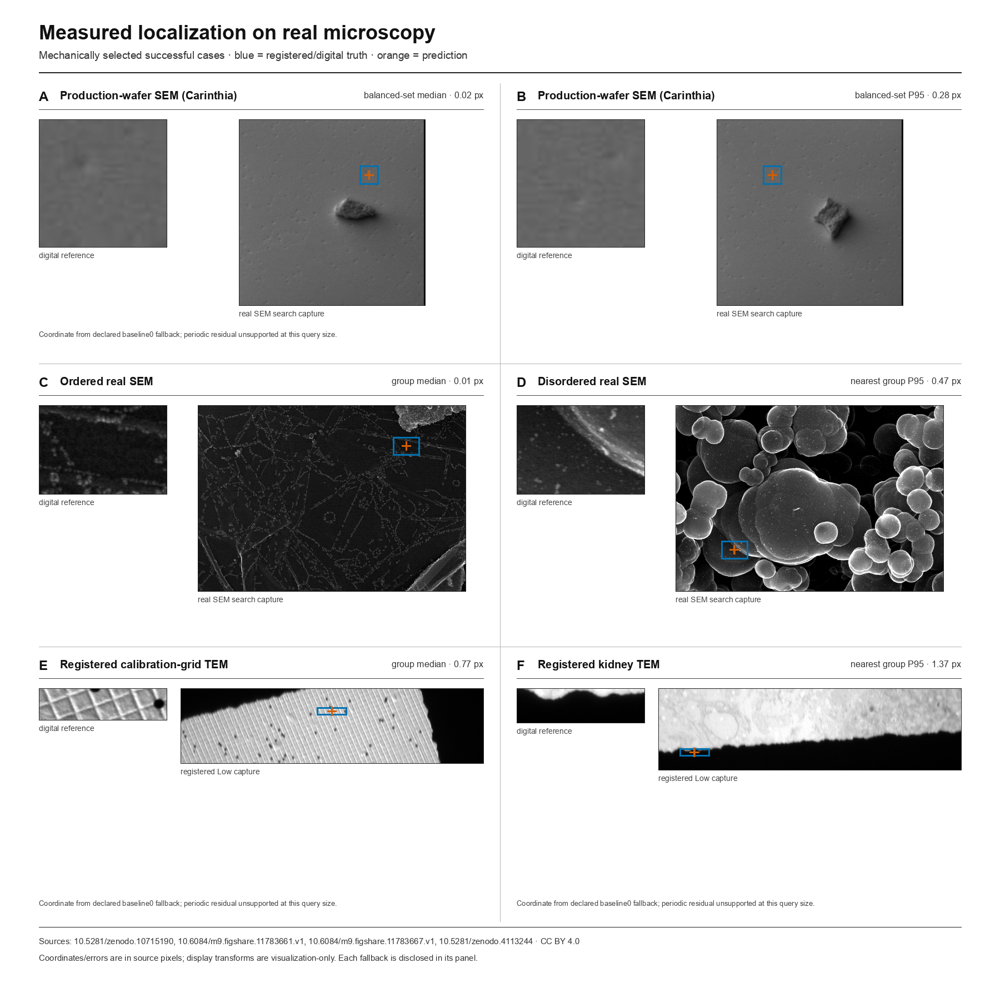
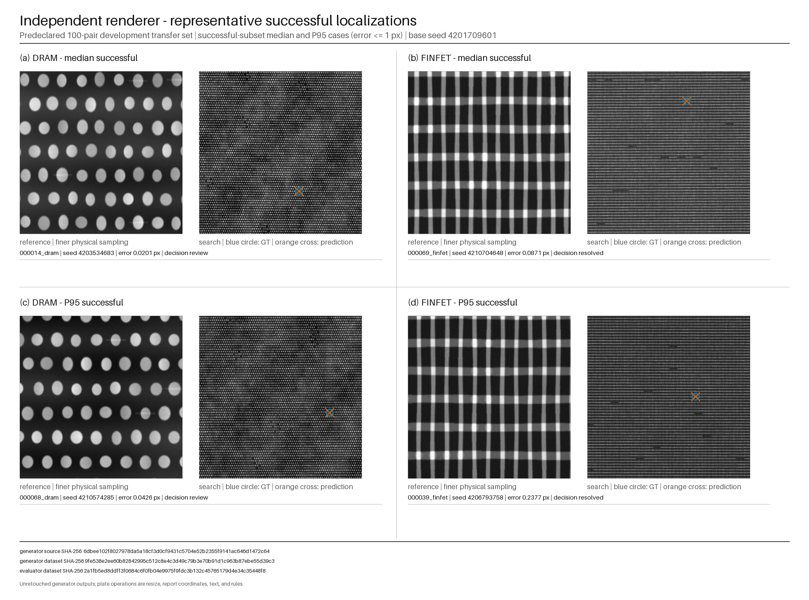

<p align="center">
  
</p>

<h1 align="center">Metralign</h1>

<p align="center">
  <strong>Absolute-site localization for periodic inspection images.</strong><br>
  A finer-sampled reference and a wider-field search go in; one subpixel search coordinate comes out.
</p>

<p align="center">
  <a href="https://github.com/Achxy/metralign/actions/workflows/tests.yml"></a>
  <a href="https://www.python.org/"></a>
  <a href="LICENSE"></a>
</p>

<p align="center">
  <a href="#run-it">Run it</a> ·
  <a href="docs/method.md">Method</a> ·
  <a href="results/frozen/ARTIFACTS.md">Frozen evidence</a> ·
  <a href="Metralign_Submission_Deck.pdf">Presentation</a> ·
  <a href="references.md">References</a>
</p>

Metralign is deterministic, training-free, CPU-only software for locating a specific field of view inside a repeated structure. Its sealed result is **1,398 / 1,400 synthetic reporting pairs within 1 px**. Licensed real SEM/TEM checks, a separately implemented renderer, and external registration baselines are reported separately; none is pooled into that frozen number.

## Run it

```bash
git clone https://github.com/Achxy/metralign.git
cd metralign
python -m pip install -c constraints.txt .

metralign --reference reference.png --search search.png
```

Successful stdout contains exactly two floating-point values:

```text
512.381204 477.992015
```

They are the reference center `(x, y)` in search-image pixels, measured from the top-left. `--diagnostics` writes structured evidence to stderr without changing stdout.

## Acquired microscopy checks

[](real_imagery/results/real-microscopy-success-plate.png)

The plate contains mechanically selected cases from four licensed dataset records across three collections. Blue denotes registered or digitally constructed truth; orange denotes the prediction. Carinthia and Boiko SEM coordinates come from deterministic crops of already acquired images. The full interface used its declared small-template fallback in 13 of 24 Carinthia cases and all 70 MiniTEM pairs. These are useful execution and texture-transfer checks, not microscope-stage ground truth.

| Evidence | Declared scope | Observation |
|---|---|---:|
| Frozen synthetic report | 1,400 pairs; seven fixed stress suites | 1,398 within 1 px; median 0.083 px; P95 0.319 px |
| Separate renderer | 100 predeclared development pairs | 97 within 1 px; median 0.044 px; P95 0.238 px |
| Carinthia wafer SEM | 24 balanced same-acquisition digital crops | 23 within 1 px; 13 / 24 used declared fallback; median 0.025 px |
| Boiko FE-SEM | 30 same-acquisition digital crops | 29 within 1 px; 30 within 5 px; median 0.015 px |
| Registered MiniTEM | 70 publisher-registered Low/GT crops | 43 within 1 px; 70 within 5 px; 70 / 70 used declared fallback |

Sources: [Carinthia wafer SEM, CC BY 4.0](https://doi.org/10.5281/zenodo.10715190); [ordered](https://doi.org/10.6084/m9.figshare.11783661.v1) and [disordered](https://doi.org/10.6084/m9.figshare.11783667.v1) FE-SEM, CC BY 4.0; [MiniTEM registered pairs, CC BY 4.0](https://doi.org/10.5281/zenodo.4113244). Exact files, hashes, selection rules, and claim boundaries are in [`real_imagery/`](real_imagery/README.md).

## Why periodic images are difficult

A generic correlator can estimate the correct scale and rotation yet land one lattice period away. Many sites have almost identical local evidence; the task is therefore absolute-site localization, not ordinary same-field registration.

Metralign uses periodicity twice:

1. Robust normalization makes the two captures comparable.
2. Reciprocal and phase structure estimates scale, rotation, and pitch.
3. Matched one-period differences attenuate the repeated backbone in both images.
4. Correlation ranks the surviving site-specific evidence and retains bounded alternatives.
5. Ambiguity logic applies a center or supplied stage prior only when low residual support or unstable transform evidence authorizes it.
6. Parabolic refinement returns the final floating-point coordinate.

If a query is too small for one-period differencing, the `full` interface uses the existing normalized-correlation fallback and explicitly marks the result for review with zero absolute-site confidence. The complete estimator and diagnostic contract are documented in [`docs/method.md`](docs/method.md) and [`docs/ambiguity-safety.md`](docs/ambiguity-safety.md).

## Frozen reporting result

The method and settings were fixed before the seven reporting suites were opened. Each suite contains 200 pairs, alternating synthetic DRAM and FinFET structures.

| Measure | Frozen observation |
|---|---:|
| Pairs | 1,400 |
| Error ≤ 0.5 px | 1,394 · 99.5714% |
| Error ≤ 1 px | 1,398 · 99.8571% |
| Error ≤ 5 px | 1,398 · 99.8571% |
| Median error | 0.0830 px |
| P95 error | 0.3193 px |
| Mean runtime | 239.405 ms |
| P95 runtime | 359.649 ms |

Runtime is evaluator wall time around `localize()` and excludes image decoding. Reports bind the manifest, every input image, implementation fingerprint, Git commit, and environment. The full artifact inventory is [`results/frozen/ARTIFACTS.md`](results/frozen/ARTIFACTS.md).

<p align="center">
  
  
</p>

<p align="center"><em>Mechanically selected suite-median frozen IID case 000002_dram. Ground truth (632.919, 234.237); prediction (632.832, 234.201); error 0.094 px.</em></p>

| Suite | ≤1 px | Median px | P95 px |
|---|---:|---:|---:|
| IID | 100.0% | 0.094 | 0.296 |
| High noise | 99.5% | 0.090 | 0.318 |
| Geometry OOD | 100.0% | 0.084 | 0.285 |
| Transform OOD | 100.0% | 0.090 | 0.313 |
| Periodic ambiguity | 100.0% | 0.025 | 0.086 |
| Scan distortion | 99.5% | 0.125 | 0.392 |
| Alternate capture renderer¹ | 100.0% | 0.110 | 0.366 |

¹ This suite changes capture and resampling but retains primary latent architecture and coordinates. The separate renderer below removes that code-path sharing.

<details>
<summary>Audit note: two frozen cases exceeded 5 px</summary>

Both were FinFET cases and both were flagged ambiguous. Weak site-specific evidence left thousands of lattice-equivalent hypotheses, and the prescribed center-nearest rule returned an incorrect absolute location while scale and rotation remained close. No parameters were changed after inspecting the reporting split. The cases and complete diagnostics remain in [`results/frozen/ARTIFACTS.md`](results/frozen/ARTIFACTS.md).

</details>

## External registration comparison

Every method below received the same frozen image bytes, nominal 0.1 sampling ratio, and coordinate definition. Unresolved cases count against the all-sample rate. Settings were fixed across suites; these are transparent task adapters, not claims of optimal tuning for every external library.

| Method | Coverage | ≤1 px | Median resolved error | Mean runtime² |
|---|---:|---:|---:|---:|
| **Metralign, archived** | 100.00% | **99.86%** | **0.083 px** | 239.4 ms |
| Official XFeat* + USAC_MAGSAC | 77.07% | 0.00% | 629.221 px | 295.7 ms |
| OpenCV scale/rotation grid + template | 100.00% | 35.57% | 250.644 px | 1,106.8 ms |
| OpenCV template + phase refinement | 100.00% | 32.57% | 266.028 px | 20.3 ms |
| scikit-image template + phase refinement | 100.00% | 32.14% | 267.710 px | 110.6 ms |
| OpenCV ECC affine | 80.71% | 30.36% | 220.515 px | 644.3 ms |
| OpenCV SIFT + RANSAC | 0.29% | 0.00% | 613.630 px | 844.3 ms |

² Timings came from separate measured runs and are not an isolated throughput benchmark. The official XFeat comparison is retrospective development evidence and uses its own predeclared population/runtime gate. Its negative result is a task-mismatch observation under a fixed adapter, not a claim about XFeat on the general matching benchmarks for which it was designed. Full settings, licenses, per-sample rows, coverage, and hashes are in [`docs/external-comparison.md`](docs/external-comparison.md) and [`results/comparisons/`](results/comparisons/).

## Separate renderer

[](assets/evidence/independent-renderer-final-100-success.png)

The transfer generator defines its own physical-nanometre homography, DRAM/FinFET layouts, persistent variation, detector model, and reference/search sampling paths. An AST regression test prevents imports from the primary architecture, geometry, distortion, renderer, or dataset modules. It remains a phenomenological synthetic model, not an independent microscope simulator.

The final 100-pair seed was declared before generation and received no post-result tuning. Metralign localized **97 / 100 within 1 px**: all 50 FinFET pairs and 47 of 50 DRAM pairs. The three misses were marked for review. On the same bytes, the best fixed classic adapter reached 73 / 100. Complete bindings and separation details are in [`docs/independent-renderer.md`](docs/independent-renderer.md).

## Reproducibility

- CPython 3.10–3.14; CPU only; no weights or network calls in Metralign inference.
- Universal version constraints and an isolated package-build toolchain are checked in.
- The reporting split retains seven manifests, seven complete schema-v2 reports, 2,800 image hashes, environment details, and a clean source commit.
- Development studies, real microscopy, external comparisons, and the independent renderer remain visibly separate from the frozen claim.
- CI exercises the default `full` path, public API, report validation, optional comparison dependencies, sensitive-data scanning, and the complete test suite.

See [`docs/reproducibility.md`](docs/reproducibility.md) for fresh-machine and evidence-rebuild commands.

## Repository guide

| Path | Purpose |
|---|---|
| [`src/drift_sense/localizer.py`](src/drift_sense/localizer.py) | Frozen-compatible internal estimator and diagnostics |
| [`src/metralign/`](src/metralign/) | Public Python and CLI namespace |
| [`evaluate.py`](evaluate.py) | Bound evaluation reports |
| [`results/frozen/`](results/frozen/) | Sealed 1,400-pair evidence |
| [`real_imagery/`](real_imagery/) | Licensed SEM/TEM protocols and reports |
| [`results/comparisons/`](results/comparisons/) | External and independent-renderer comparisons |
| [`references.md`](references.md) | Mechanism-to-code evidence matrix and DOI bibliography |

## Scope

The frozen result is synthetic and does not establish calibrated microscope accuracy. The real datasets do not provide native stage truth for this exact challenge. The separate renderer is independently implemented but still synthetic. Runtime depends on hardware and numerical libraries. Metralign exposes ambiguity and review diagnostics because a periodic image can be insufficient to identify an absolute site.

## Citation

Citation metadata is available in [`CITATION.cff`](CITATION.cff).

```bibtex
@software{jayadevan_karmakar_2026_metralign,
  author  = {Achyuth Jayadevan and Pramit Karmakar},
  title   = {Metralign: deterministic localization under periodic semiconductor structures},
  year    = {2026},
  version = {0.2.0},
  url     = {https://github.com/Achxy/metralign}
}
```

Created by Achyuth Jayadevan and Pramit Karmakar. Released under the [MIT License](LICENSE).
