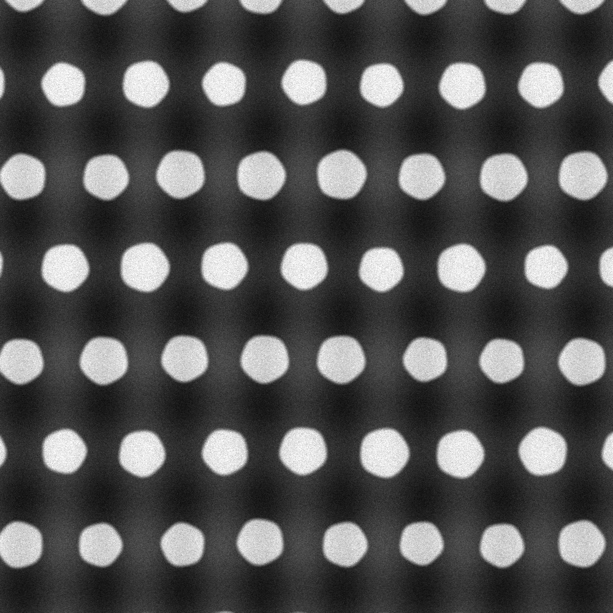
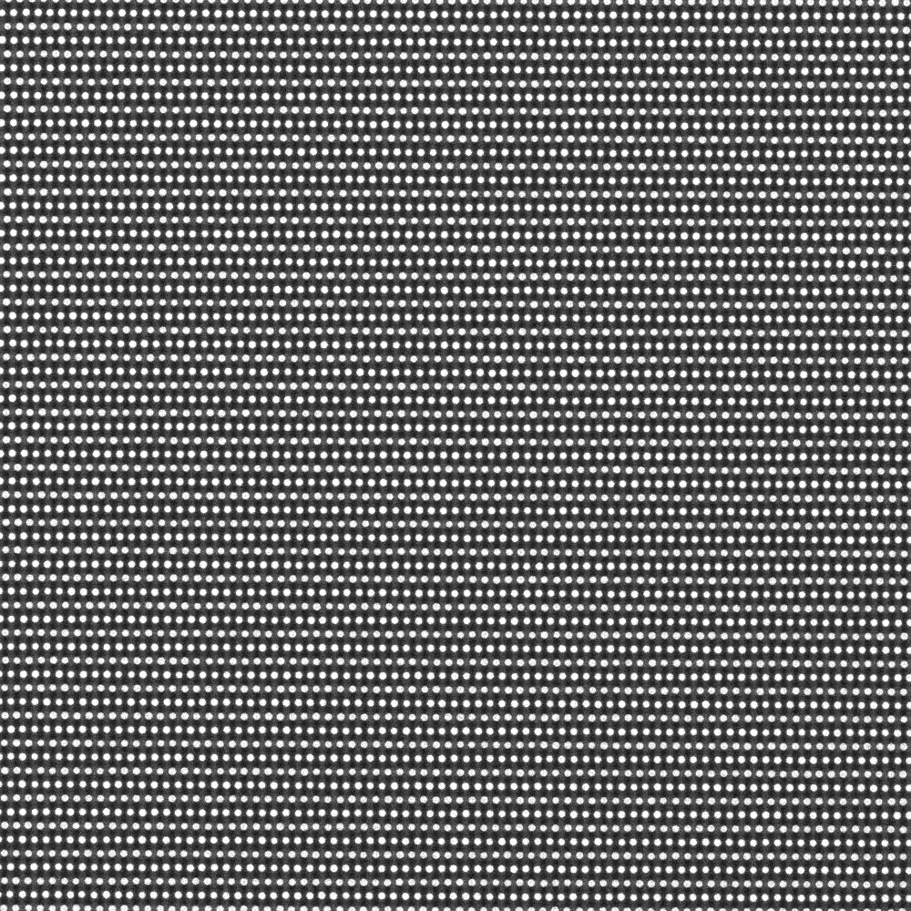
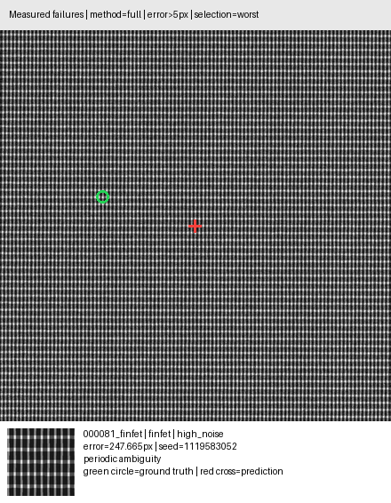
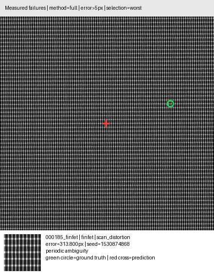

<p align="center">
  
</p>

<h1 align="center">Metralign</h1>

<p align="center">
  <strong>Deterministic, training-free localization under periodic ambiguity.</strong><br>
  Input: a finely sampled reference and a wider-field search. Output: the reference center in search pixels.
</p>

<p align="center">
  Evaluated on a frozen 1,400-pair <strong>synthetic</strong> wafer-structure stress test.<br>
  The results in this repository are not measurements from a calibrated microscope.
</p>

<p align="center">
  <a href="https://github.com/Achxy/metralign/actions/workflows/tests.yml"></a>
  <a href="https://www.python.org/"></a>
  <a href="LICENSE"></a>
</p>

<p align="center">
  <a href="https://youtu.be/i7V0aO1jFd4">Project film</a> ·
  <a href="DriftSense_LatticeLock_Frozen.pdf">Presentation</a> ·
  <a href="results/frozen/ARTIFACTS.md">Frozen evidence</a> ·
  <a href="references.md">Scientific references</a>
</p>

---

## Abstract

Metralign estimates where a finely sampled reference field appears inside a wider-field search image. Both inputs contain repeated wafer-like structure, so ordinary template matching can select a visually equivalent site one or more lattice periods away. The command-line interface returns the reference center in search-image pixels as two floating-point numbers: `x y`.

The default method uses the lattice twice. Phase drift first estimates scale, rotation, and axis-aligned pitch. Matched differences at rounded pitch shifts then suppress the repeated backbone so that weaker site-specific evidence can determine absolute position. If robust-normalized backbone fallback produces multiple score-tied peaks and secondary ambiguity evidence is present, the method applies the prescribed center-nearest rule among those peaks.

Metralign is the project name. The Python distribution and import package retain the names `drift-sense` and `drift_sense`.

<p align="center">
  
</p>

<p align="center"><em>Fine-sampling reference · frozen IID case 000002_dram</em></p>

<p align="center">
  
</p>

<p align="center"><em>Wider-field search · seed 1011209461. Both images are 1000 × 1000 pixels; the search covers approximately ten times the physical width. Ground truth: (632.919, 234.237). Prediction: (632.832, 234.201). Error: 0.094 px.</em></p>

## Frozen result

The archived reporting split was evaluated once after the method and settings were fixed. It contains 200 pairs from each of seven suites, alternating synthetic DRAM and FinFET structures.

| Measure | Frozen observation |
|---|---:|
| Pairs | 1,400 |
| Error ≤ 0.5 px | 1,394 / 1,400 · 99.5714% |
| Error ≤ 1 px | 1,398 / 1,400 · 99.8571% |
| Error ≤ 5 px | 1,398 / 1,400 · 99.8571% |
| Median error | 0.0830 px |
| P95 error | 0.3193 px |
| Mean runtime | 239.405 ms |
| P95 runtime | 359.649 ms |

Runtime is evaluator wall time immediately around `localize()`. It excludes image decoding and report construction. The mean error is 0.5152 px because two large outliers dominate it; the mean over the 1,398 cases within 5 px is 0.1143 px.

## Method

The default `full` path has six stages:

1. **Normalize.** Clip each image to its 1st–99th percentile range and apply robust median/MAD normalization.
2. **Calibrate the lattice.** Estimate two fundamental periods and use phase drift across scan lines to recover relative scale and rotation. A bounded residual search handles low-confidence estimates.
3. **Cancel the periodic backbone.** Warp reference templates at candidate transforms. Apply the same symmetric spatial-difference operator to reference and search using integer axis shifts derived from the estimated pitches.
4. **Match residual evidence.** Use separable one-dimensional correlation only when the measured structure supports that model. Otherwise retain both residual channels and correlate them jointly in two dimensions.
5. **Resolve ambiguity.** Inspect every threshold-qualified local maximum, not only the stored top-K list. The center-nearest rule is allowed only when a score tie is corroborated by weak residual evidence, low transform-estimate confidence, or local score-neighborhood variation.
6. **Refine.** Apply bounded axis-wise parabolic refinement when the local peak supports it, then return floating-point search-image coordinates.

There are no learned weights, remote services, notebooks, or GPU requirements. Coordinates are reproducible when input bytes, source, arguments, CPU/software environment, and numerical backend are fixed; runtime varies between runs. The complete estimator, diagnostic fields, bounds, and legacy baselines are documented in [Method](docs/method.md).

## Frozen evaluation by suite

Each suite contains 200 pairs.

| Synthetic stress suite | ≤0.5 px | ≤1 px | Median (px) | P95 (px) | Maximum (px) |
|---|---:|---:|---:|---:|---:|
| IID | 100.0% | 100.0% | 0.094 | 0.296 | 0.447 |
| High noise | 98.5% | 99.5% | 0.090 | 0.318 | 247.665 |
| Geometry OOD | 100.0% | 100.0% | 0.084 | 0.285 | 0.469 |
| Transform OOD | 100.0% | 100.0% | 0.090 | 0.313 | 0.451 |
| Periodic ambiguity | 100.0% | 100.0% | 0.025 | 0.086 | 0.165 |
| Scan distortion | 99.5% | 99.5% | 0.125 | 0.392 | 313.800 |
| Alternate capture renderer¹ | 99.0% | 100.0% | 0.110 | 0.366 | 0.543 |

¹ The alternate renderer changes the capture and resampling paths, edge response, blur, illumination, noise ordering, and parameter distributions. It still shares the latent architecture and coordinate geometry with the primary renderer. This is a capture-renderer shift, not validation against an independent physical simulator.

Every value above is recoverable from the seven schema-v2 reports in [`results/frozen/reports/`](results/frozen/reports/). The aggregate, manifests, representative cases, and environment record are indexed in [`results/frozen/ARTIFACTS.md`](results/frozen/ARTIFACTS.md).

## The two cases above 5 px

The reporting split contains two errors above 5 px. Both are FinFET cases, and both were flagged ambiguous by the localizer. They are shown here rather than omitted from the headline result.

<p align="center">
  
</p>

<p align="center"><em>high_noise/000081_finfet · 247.665 px</em></p>

<p align="center">
  
</p>

<p align="center"><em>scan_distortion/000185_finfet · 313.800 px. Green marks ground truth; red marks the prediction.</em></p>

In the high-noise case, residual evidence is 0.201 and the ambiguity scan retains 4,606 periodic alternatives. In the scan-distortion case, residual evidence is 0.176, 4,428 alternatives remain, and reliable-basis coverage is 50.9%. These diagnostics are consistent with the same limitation: the synthetic FinFET pattern can become nearly one-dimensional, leaving too little site-specific evidence to distinguish an off-center location from a central periodic alias. Scale and rotation remain close in both cases. No parameter changes followed inspection of the reporting split.

## Install and run

Metralign supports CPython 3.10–3.14.

```bash
git clone https://github.com/Achxy/metralign.git
cd metralign
python -m pip install -c constraints.txt .
```

Infer a coordinate:

```bash
python infer.py \
  --reference path/to/reference.png \
  --search path/to/search.png
```

Successful stdout contains exactly one line:

```text
512.381204 477.992015
```

The origin is the top-left search pixel. `x` increases rightward and `y` downward. Add `--diagnostics` to write structured diagnostics to stderr without changing stdout.

To generate and evaluate a self-contained synthetic example:

```bash
python generate_dataset.py \
  --architecture dram \
  --num-pairs 1 \
  --output-dir data/example \
  --seed 2026

python evaluate.py \
  --data-dir data/example \
  --method full \
  --output results/example.json
```

Large suites are CPU- and storage-intensive. Use a volume with adequate free space. See [Command examples](examples/README.md) for the benchmark, augmentation-sensitivity, and controlled-pipeline interfaces.

## Synthetic capture model

The generator renders the reference and search independently from one continuous latent field. It does not paste a completed reference image into the search. Ground-truth centers are transformed from shared world coordinates and corrected for simulated scan-line displacement. No brightness barcode or explicit location label is embedded in the images.

The primary reference and search captures use different resampling paths, reducing reliance on a shared interpolation artifact. The alternate-renderer suite changes more of the capture process, subject to the shared-latent limitation stated above.

This remains a phenomenological stress test. It is not calibrated to a named microscope, process node, material stack, beam energy, or dose. Literature support for an included mechanism does not establish that the configured synthetic range is physically typical. The mechanism-to-code evidence matrix and DOI bibliography are in [`references.md`](references.md).

## Development evidence

The table below comes from one fixed 100-pair IID **development** manifest. It records cumulative stages of the selected pipeline and explains the release configuration. It is not part of the frozen reporting split.

| Cumulative stage | ≤1 px | P95 error (px) | Mean runtime (ms) |
|---|---:|---:|---:|
| ZNCC starting point | 38% | 741.941 | 51.4 |
| + phase calibration | 46% | 639.186 | 146.7 |
| + raw spatial residual | 95% | 13.435 | 167.5 |
| + structural spatial residual | 100% | 0.643 | 220.0 |
| + reliable-basis diagnostics | 100% | 0.643 | 222.9 |
| + multi-evidence ambiguity rule | 100% | 0.643 | 220.0 |
| + parabolic subpixel refinement | 100% | 0.259 | 217.3 |

The same artifact compares parabolic, local-DFT, and no subpixel refinement. It also records K = 8, 16, 32, 64, and 128. All five K values produce identical coordinates on this manifest, so K = 32 is retained as a stable middle setting rather than claimed as an optimized value. Source: [`results/frozen/development/pipeline-study.json`](results/frozen/development/pipeline-study.json).

## Reproducibility and provenance

The archived run used algorithm commit `c9363bfce535a812eb541417f3297602e97f619a` and implementation SHA-256 `7819d767b5ab3aeadd40bb99addefcf28948bca9c07bb7a84b5fb20345f39881`. All seven reports record a clean working tree. Release verification recomputed the 1,400 report rows against their manifests, 2,800 image hashes, ground-truth coordinates, Euclidean errors, subgroup metrics, and aggregate entries.

The aggregate file is [`results/frozen/benchmark_report.json`](results/frozen/benchmark_report.json). Its SHA-256 is:

```text
a169bffa170707da166206640150702c87202670a1a22745ff6128ad46ff5b69
```

The checked-in constraints reproduce package selection for the supported Python versions. Reproducing a recorded result also requires the recorded source commit, inputs, arguments, and platform context. The [Reproducibility protocol](docs/reproducibility.md) separates the fresh-machine smoke test, development studies, and frozen reporting procedure.

| Record | Location |
|---|---|
| Frozen artifact inventory | [`results/frozen/ARTIFACTS.md`](results/frozen/ARTIFACTS.md) |
| Seven complete evaluation reports | [`results/frozen/reports/`](results/frozen/reports/) |
| Exact suite manifests | [`results/frozen/manifests/`](results/frozen/manifests/) |
| Algorithm specification | [`docs/method.md`](docs/method.md) |
| Reproduction procedure | [`docs/reproducibility.md`](docs/reproducibility.md) |
| Citation and mechanism audit | [`references.md`](references.md) |
| Presentation evidence map | [`PRESENTATION.md`](PRESENTATION.md) |
| Editable presentation | [`DriftSense_LatticeLock_Frozen.pptx`](DriftSense_LatticeLock_Frozen.pptx) |
| Rendered presentation | [`DriftSense_LatticeLock_Frozen.pdf`](DriftSense_LatticeLock_Frozen.pdf) |

## Scope

- Evaluation is synthetic. No claim of calibrated physical accuracy is made.
- The alternate capture renderer is not an independent generator of device geometry.
- The frozen benchmark has two large FinFET failures despite strong median and tail performance elsewhere.
- Runtime was measured on one CPU environment and is not a cross-platform throughput guarantee.
- Legacy methods remain available for comparison, but they are not cumulative stages of the selected pipeline.

## Citation

Citation metadata is available in [`CITATION.cff`](CITATION.cff).

```bibtex
@software{jayadevan_karmakar_2026_metralign,
  author  = {Achyuth Jayadevan and Pramit Karmakar},
  title   = {Metralign: deterministic localization under periodic semiconductor structures},
  year    = {2026},
  version = {0.1.0},
  url     = {https://github.com/Achxy/metralign}
}
```

Created by Achyuth Jayadevan and Pramit Karmakar. Released under the [MIT License](LICENSE).
